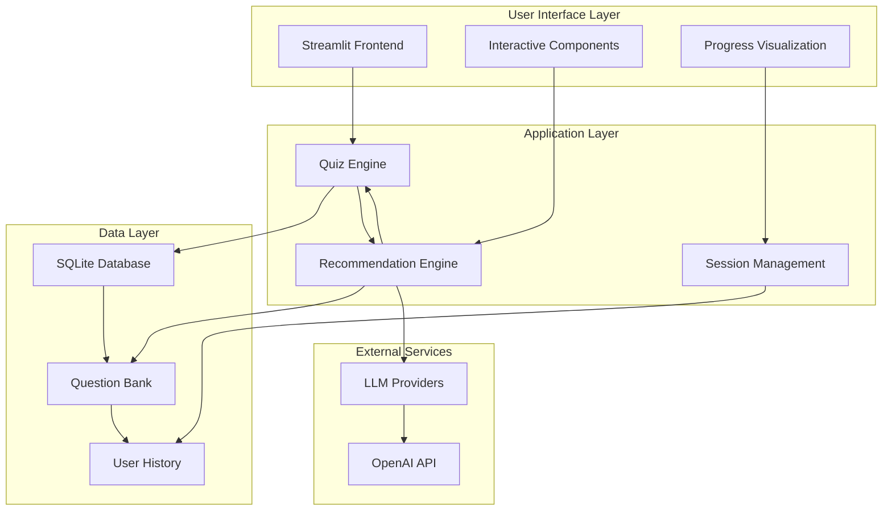

# Project Title: AI Quiz & Recommendation System

## 1. Project Overview

The AI Quiz & Recommendation System is an advanced intelligent assessment platform that combines adaptive learning algorithms with personalized recommendation engines to deliver comprehensive educational experiences. This sophisticated system evaluates user knowledge across multiple domains, analyzes performance patterns through machine learning, and generates tailored learning recommendations to optimize individual educational outcomes.

## 2. Objective

The primary objective of the AI Quiz & Recommendation System is to revolutionize personalized education by:
- Delivering adaptive assessments that dynamically adjust to individual learning patterns and performance levels
- Providing comprehensive multi-dimensional performance analytics with detailed knowledge gap identification
- Generating intelligent learning recommendations through advanced machine learning algorithms and collaborative filtering
- Tracking longitudinal progress to identify learning trends and optimize educational pathways
- Creating an intuitive, responsive interface that enhances user engagement and learning outcomes

## 3. Technologies and Tools

- **Programming Language:** Python 3.8+
- **Frontend Framework:** Streamlit with custom CSS styling
- **Machine Learning Libraries:** 
  - scikit-learn for recommendation algorithms
  - NumPy for vectorized operations
  - Pandas for data manipulation and analysis
- **Database Management:** SQLite with migration support and query optimization
- **AI Integration:**
  - OpenAI GPT models for personalized educational advice
  - LangChain for advanced prompt engineering and chain-of-thought reasoning
- **Data Validation:** Pydantic for type safety and schema validation
- **Visualization:** Plotly for interactive charts and performance analytics
- **Additional Services:**
  - **quiz_engine.py:** Implements adaptive assessment algorithms and scoring mechanisms
  - **recommendation_engine.py:** Manages ML-based learning path generation and content recommendations
  - **database.py:** Provides comprehensive data persistence with performance optimization

## 4. System Requirements

- **Operating System:** Windows 10+, Linux (Ubuntu 18.04+), or macOS 10.14+
- **Hardware:** 
  - CPU: Modern dual-core processor (Intel i3-8100 or AMD Ryzen 3 2200G minimum)
  - RAM: 4GB minimum, 8GB+ recommended for optimal performance
  - Storage: 2GB+ available space for application and database
  - Network: Internet connection for LLM integration (optional but recommended)
- **Software:** Python 3.8+, pip package manager, web browser (Chrome, Firefox, Safari, Edge)

## 5. Setup Instructions

**a. Environment Setup**

1. **Clone the Repository:**
   ```
   git clone https://github.com/prathameshv07/AI_Quiz_System.git
   cd AI_Quiz_System
   ```

2. **Create and Activate Virtual Environment:**
   ```
   python -m venv venv
   # On Windows
   venv\Scripts\activate
   # On Linux/macOS  
   source venv/bin/activate
   ```

3. **Install Dependencies:**
   ```
   pip install -r requirements.txt
   ```

4. **Initialize Database:**
   ```
   python -c "from core.database import init_database; init_database()"
   ```

**b. Advanced Configuration**

1. **Environment Variables Setup:**
   ```
   cp .env.example .env
   # Edit .env with your configuration
   ```

2. **Streamlit Configuration:**
   Create `.streamlit/config.toml` for custom themes, performance settings, and deployment options.

3. **Database Optimization:**
   Configure SQLite settings in `core/database.py` for production deployment.

## 6. Detailed Project Structure

```
AI_Quiz_System/
├── app.py                          # Main Streamlit application entry point
├── core/
│   ├── __init__.py                 # Package initialization
│   ├── models.py                   # Pydantic data models and validation schemas
│   ├── database.py                 # Database operations, migrations, and optimization
│   ├── quiz_engine.py              # Adaptive quiz algorithms and scoring logic
│   └── recommendation_engine.py    # ML recommendation algorithms and personalization
├── ui/
│   ├── __init__.py
│   ├── components.py               # Reusable UI components and widgets
│   └── styles.py                   # Custom CSS styling and theme management
├── llm/
│   ├── __init__.py
│   ├── providers.py                # LLM integration and API management
│   └── prompts.py                  # Prompt templates and engineering strategies
├── data/
│   ├── questions.json              # Comprehensive question database
├── requirements.txt                # Python dependencies
└── .env.example                    # Environment variables template
```

## 7. Core Components

- **Adaptive Quiz Engine:**  
  The `quiz_engine.py` module implements sophisticated adaptive assessment algorithms that dynamically select questions based on real-time performance analysis. It features intelligent difficulty progression, multi-dimensional scoring across knowledge domains, comprehensive performance tracking, and adaptive question selection using item response theory principles.

- **Machine Learning Recommendation Engine:**  
  The `recommendation_engine.py` module leverages advanced machine learning algorithms including collaborative filtering, content-based recommendations, and hybrid approaches to generate personalized learning paths. It analyzes user performance patterns, identifies knowledge gaps through clustering algorithms, and provides intelligent resource recommendations.

- **Database Management System:**  
  The `database.py` module provides comprehensive data persistence with SQLite integration, featuring automated migrations, query optimization, connection pooling, and performance monitoring. It handles user sessions, quiz results, historical analytics, and recommendation data with full ACID compliance.

- **Interactive User Interface:**  
  The `ui/components.py` module implements responsive, accessible UI components including interactive question cards, real-time progress visualization, comprehensive results dashboards, and personalized recommendation panels. All components are optimized for performance and user experience.

- **LLM Integration Framework:**  
  The `llm/providers.py` module manages integration with multiple language model providers, featuring intelligent prompt engineering, response optimization, and personalized educational content generation through advanced chain-of-thought reasoning.

## 8. Usage Guide

**a. Running the Application:**
- Start the Streamlit server:
  ```
  streamlit run app.py
  ```
- The application will be available at `http://localhost:8501`

**b. Assessment Workflow:**
1. **Mode Selection:** Choose between Quick Demo (10 questions) or Full Assessment (comprehensive evaluation)
2. **Adaptive Assessment:** Progress through intelligently selected questions with real-time difficulty adjustment
3. **Performance Monitoring:** View live scoring, progress tracking, and knowledge area analysis
4. **Results Analysis:** Review comprehensive performance metrics, knowledge gaps, and learning insights
5. **Personalized Recommendations:** Receive ML-generated learning paths and resource suggestions

## 9. Assessment Features

- **Adaptive Question Selection:** Dynamic difficulty adjustment based on performance using item response theory
- **Multi-dimensional Scoring:** Comprehensive analysis across AI/ML knowledge domains
- **Knowledge Gap Analysis:** Precise identification of specific improvement areas through clustering
- **Progress Tracking:** Historical performance monitoring with trend analysis and predictive insights
- **Personalized Recommendations:** Machine learning-powered learning path generation
- **Interactive Analytics:** Real-time performance visualization with drill-down capabilities

## 10. Architecture Diagram



**Key Architecture Features:**

- **Modular Design:** Clean separation of concerns with distinct layers for UI, business logic, and data persistence
- **Adaptive Algorithms:** Machine learning-powered recommendation engine with collaborative filtering and content-based approaches
- **Real-time Analytics:** Live performance monitoring with interactive visualizations and progress tracking
- **Scalable Database:** SQLite with migration support and optimized query performance
- **LLM Integration:** Flexible provider architecture supporting multiple language models with intelligent prompt engineering
- **Component-Based UI:** Reusable Streamlit components with consistent styling and responsive design

## 11. Optimization Features

- **Caching Strategy:** LRU cache implementation for questions, results, and recommendations
- **Vectorized Operations:** NumPy-based calculations for improved performance
- **Lazy Loading:** On-demand resource loading to minimize startup time
- **Connection Pooling:** Efficient database connection management
- **Asynchronous Processing:** Non-blocking operations for enhanced responsiveness
- **Memory Management:** Optimized data structures and garbage collection