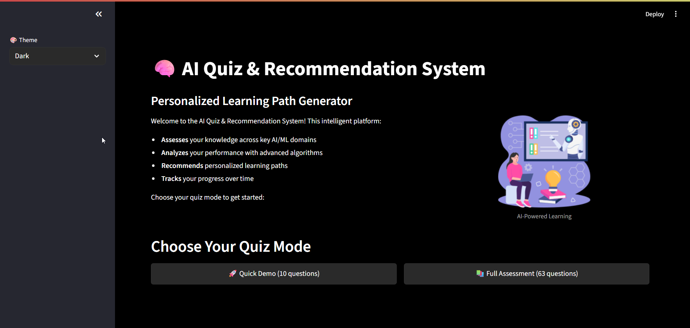

# AI Quiz & Recommendation System



## Project Overview

The AI Quiz & Recommendation System is a sophisticated intelligent assessment platform that leverages advanced machine learning algorithms to provide personalized learning experiences. This comprehensive system evaluates user knowledge across multiple AI/ML domains, analyzes performance patterns, and generates tailored learning recommendations to optimize individual learning paths.

## Objective

The primary objective of the AI Quiz & Recommendation System is to revolutionize personalized learning by:
- Delivering adaptive assessments that adjust to individual learning patterns
- Providing comprehensive performance analytics with multi-dimensional scoring
- Generating personalized learning recommendations through machine learning algorithms
- Tracking progress over time to identify knowledge gaps and learning trends
- Creating an intuitive, responsive interface for seamless user interaction

## Demo & Documentation

- 📄 [Project Documentation](documentation.md)
- 🎥 [Video Preview](https://drive.google.com/file/d/1gBlS9XQ4CGe4Q7xfzRTcD_wuO-GikFAW/view)

## Setup Instructions

**a. Environment Setup**

1. **Clone the Repository:**
   ```
   git clone https://github.com/prathameshv07/AI_Quiz_System.git
   cd AI_Quiz_System
   ```

2. **Create and Activate Virtual Environment:**
   ```
   python -m venv venv
   # On Windows
   venv\Scripts\activate
   # On Linux/macOS
   source venv/bin/activate
   ```

3. **Install Dependencies:**
   ```
   pip install -r requirements.txt
   ```

4. **Initialize Database:**
   ```
   python -c "from core.database import init_database; init_database()"
   ```

## Usage Guide

- Start the Streamlit server:
  ```
  streamlit run app.py
  ```
- The application will be available at `http://localhost:8501`
