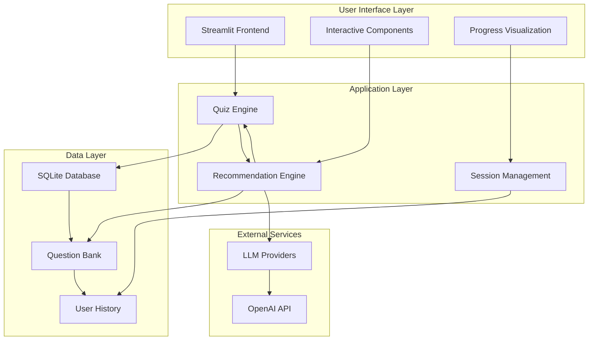

# AI Quiz & Recommendation System

## 1. Project Overview

The AI Quiz & Recommendation System is a sophisticated intelligent assessment platform that leverages advanced machine learning algorithms to provide personalized learning experiences. This comprehensive system evaluates user knowledge across multiple AI/ML domains, analyzes performance patterns, and generates tailored learning recommendations to optimize individual learning paths.

## 2. Objective

The primary objective of the AI Quiz & Recommendation System is to revolutionize personalized learning by:
- Delivering adaptive assessments that adjust to individual learning patterns
- Providing comprehensive performance analytics with multi-dimensional scoring
- Generating personalized learning recommendations through machine learning algorithms
- Tracking progress over time to identify knowledge gaps and learning trends
- Creating an intuitive, responsive interface for seamless user interaction

## 3. Technologies and Tools

- **Programming Language:** Python 3.8+
- **Frontend Framework:** Streamlit
- **Machine Learning:** scikit-learn, NumPy, Pandas
- **Database:** SQLite with migration support
- **AI Integration:** 
  - OpenAI GPT models for personalized advice
  - LangChain for advanced prompt engineering
- **Data Models:** Pydantic for type safety and validation
- **Visualization:** Plotly for interactive charts and analytics
- **Additional Services:**
  - **quiz_engine.py:** Handles adaptive question selection and scoring algorithms
  - **recommendation_engine.py:** Manages ML-based recommendation generation
  - **database.py:** Provides comprehensive data persistence and retrieval

## 4. System Requirements

- **Operating System:** Windows, Linux, or macOS
- **Hardware:** 
  - CPU: Modern dual-core processor (Intel i3 or AMD Ryzen 3 minimum)
  - RAM: 4GB minimum, 8GB+ recommended
  - Storage: 2GB+ available space
- **Software:** Python 3.8+, pip package manager
- **Network:** Internet connection for LLM integration (optional)

## 5. Setup Instructions

**a. Environment Setup**

1. **Clone the Repository:**
   ```
   git clone https://github.com/prathameshv07/ai-quiz-system.git
   cd ai-quiz-system
   ```

2. **Create and Activate Virtual Environment:**
   ```
   python -m venv venv
   # On Windows
   venv\Scripts\activate
   # On Linux/macOS
   source venv/bin/activate
   ```

3. **Install Dependencies:**
   ```
   pip install -r requirements.txt
   ```

4. **Initialize Database:**
   ```
   python -c "from core.database import init_database; init_database()"
   ```

**b. Optional Configuration**

1. **Set Environment Variables:**
   ```
   cp .env.example .env
   # Edit .env with your API keys (optional)
   ```

2. **Configure Streamlit:**
   Create `.streamlit/config.toml` for custom themes and settings.

## 6. Detailed Project Structure

```
ai-quiz-system/
├── app.py                          # Main Streamlit application entry point
├── core/
│   ├── __init__.py                 # Package initialization
│   ├── models.py                   # Pydantic data models and schemas
│   ├── database.py                 # Database operations and migrations
│   ├── quiz_engine.py              # Quiz logic and adaptive scoring
│   └── recommendation_engine.py    # ML recommendation algorithms
├── ui/
│   ├── __init__.py
│   ├── components.py               # Reusable UI components
│   └── styles.py                   # Custom CSS styling and themes
├── llm/
│   ├── __init__.py
│   ├── providers.py                # LLM integration and API handling
│   └── prompts.py                  # Prompt templates and engineering
├── data/
│   ├── questions.json              # Question database and metadata
│   └── quiz_system.db              # SQLite database file
├── tests/
│   ├── __init__.py
│   ├── test_quiz_engine.py         # Unit tests for quiz logic
│   ├── test_database.py            # Database operation tests
│   └── test_recommendations.py     # Recommendation engine tests
├── .streamlit/
│   └── config.toml                 # Streamlit configuration
├── requirements.txt                # Python dependencies
└── .env.example                    # Environment variables template
```

## 7. Core Components

- **Quiz Engine Module:**  
  The `quiz_engine.py` module implements adaptive assessment algorithms that dynamically select questions based on user performance, calculate multi-dimensional scores, and provide real-time difficulty adjustment. It features intelligent question selection, comprehensive scoring mechanisms, and progress tracking capabilities.

- **Recommendation Engine:**  
  The `recommendation_engine.py` module leverages machine learning algorithms including collaborative filtering and content-based recommendations to generate personalized learning paths. It analyzes user performance patterns, identifies knowledge gaps, and suggests optimal learning resources.

- **Database Management:**  
  The `database.py` module provides comprehensive data persistence with SQLite integration, migration support, and efficient query optimization. It handles user sessions, quiz results, historical data, and performance analytics with full ACID compliance.

- **User Interface Components:**  
  The `ui/components.py` module implements reusable, responsive UI elements including interactive question cards, progress visualizations, results dashboards, and recommendation panels. All components are optimized for performance and accessibility.

- **LLM Integration:**  
  The `llm/providers.py` module manages integration with language models for enhanced personalized advice, dynamic content generation, and intelligent tutoring capabilities through optimized prompt engineering.

## 8. Usage Guide

**a. Running the Application:**
- Start the Streamlit server:
  ```
  streamlit run app.py
  ```
- The application will be available at `http://localhost:8501`

**b. Assessment Workflow:**
1. **Mode Selection:** Choose between Quick Demo (10 questions) or Full Assessment (comprehensive evaluation)
2. **Question Navigation:** Progress through questions with intelligent difficulty adaptation
3. **Performance Analysis:** View real-time scoring and progress tracking
4. **Results Review:** Analyze comprehensive performance metrics and knowledge gaps
5. **Recommendations:** Receive personalized learning paths and resource suggestions

## 9. Assessment Features

- **Adaptive Question Selection:** Dynamic difficulty adjustment based on performance
- **Multi-dimensional Scoring:** Comprehensive analysis across knowledge domains
- **Knowledge Gap Analysis:** Identification of specific improvement areas
- **Progress Tracking:** Historical performance monitoring and trend analysis
- **Personalized Recommendations:** ML-powered learning path generation
- **Interactive Analytics:** Real-time performance visualization and insights

## 10. Architecture Diagram



**Key Architecture Features:**

- **Modular Design:** Clean separation of concerns with distinct layers for UI, business logic, and data persistence
- **Adaptive Algorithms:** Machine learning-powered recommendation engine with collaborative filtering and content-based approaches
- **Real-time Analytics:** Live performance monitoring with interactive visualizations and progress tracking
- **Scalable Database:** SQLite with migration support and optimized query performance
- **LLM Integration:** Flexible provider architecture supporting multiple language models with intelligent prompt engineering
- **Component-Based UI:** Reusable Streamlit components with consistent styling and responsive design

## 11. Optimization Features

- **Caching Strategy:** LRU cache implementation for questions, results, and recommendations
- **Vectorized Operations:** NumPy-based calculations for improved performance
- **Lazy Loading:** On-demand resource loading to minimize startup time
- **Connection Pooling:** Efficient database connection management
- **Asynchronous Processing:** Non-blocking operations for enhanced responsiveness
- **Memory Management:** Optimized data structures and garbage collection

## 12. License

This project is licensed under the **MIT License**.  
You are free to **use, modify, and distribute** this software under the terms of the MIT License.

See the [LICENSE](LICENSE) file for full details.